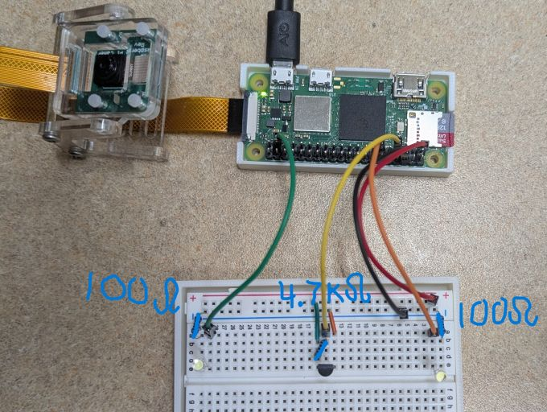
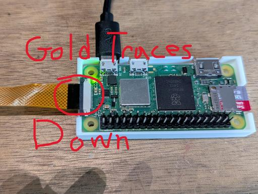
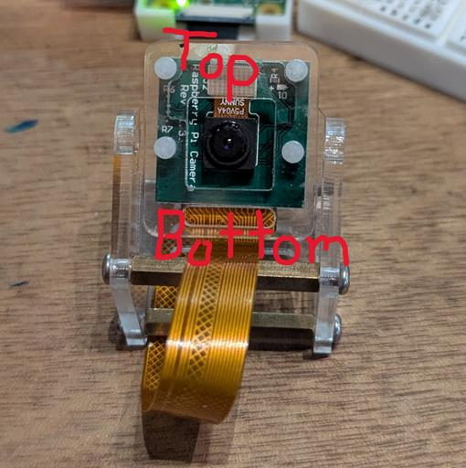
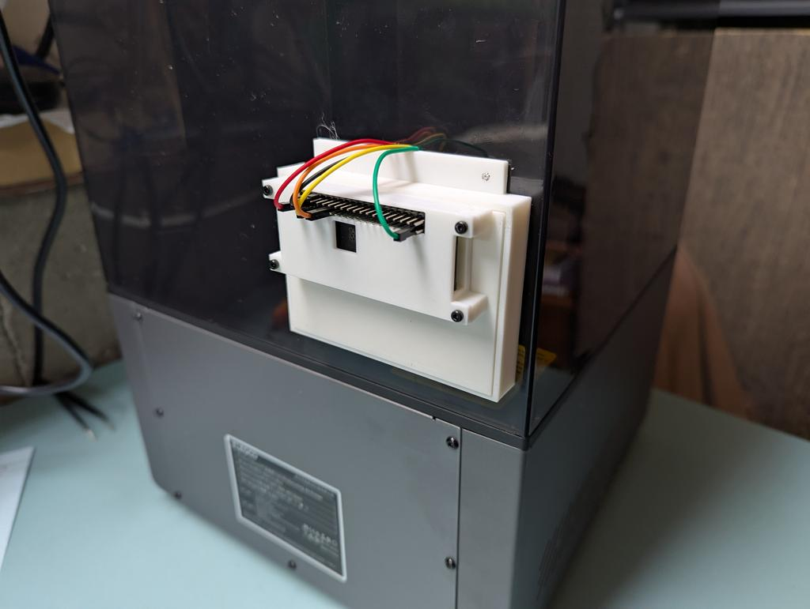
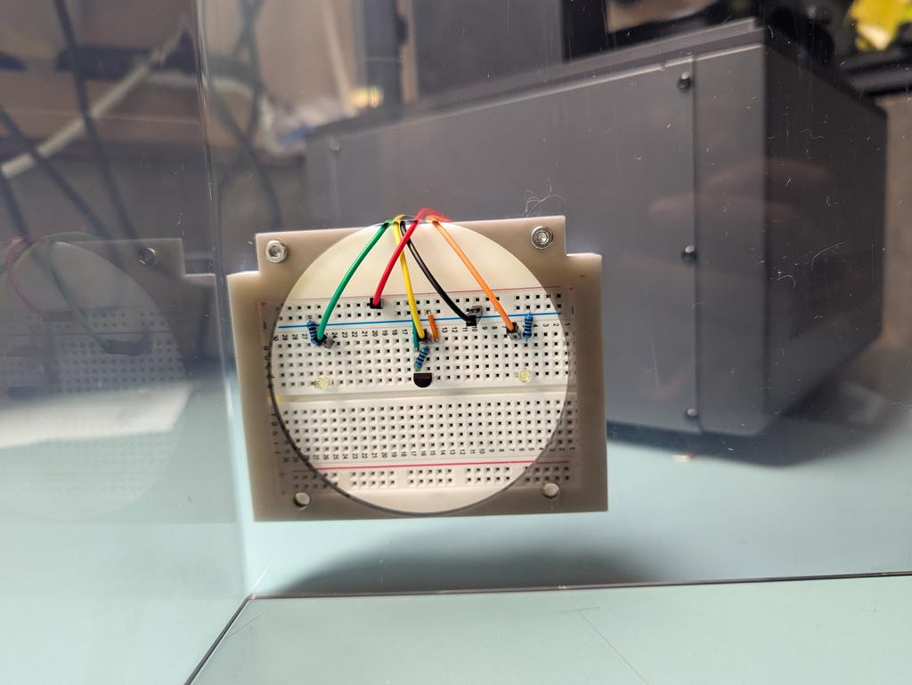
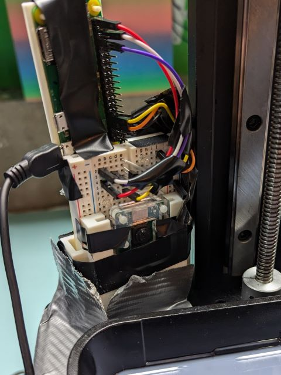
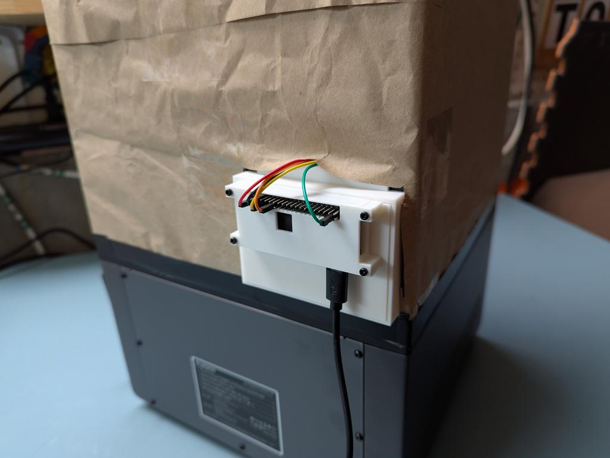
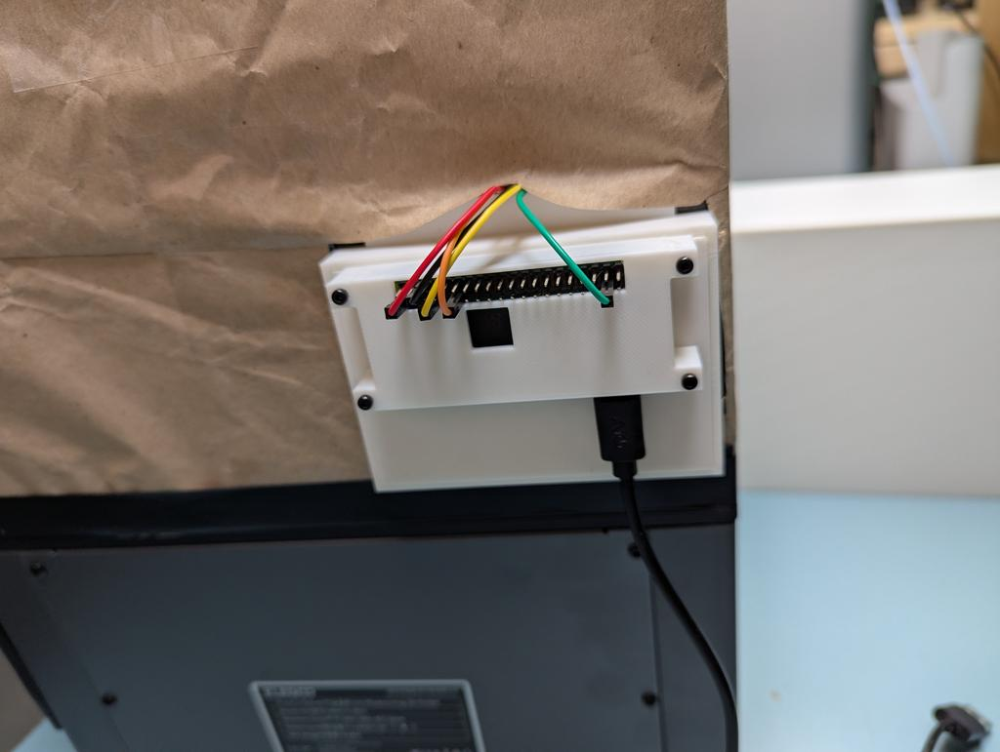

# Printer Camera

## Project Description

This project was conceived because I have a resin 3D printer that I want to run outside. Because the printer is outside, I need to leave it blocked from sunlight. Therefore, I cannot check on the print by lifting the lid (at least not during the daytime).

I have added a temperature sensor to be able to monitor how hot the internals of the printer may be getting. See the developer notes below.

### Features

    ✅ Turns on a camera on a set interval
    ✅ Turns on a camera with ad hoc command and/or separate program
    ✅ Turn on light(s) before recording with the camera (and off after recording)
    ✅ Turns on light with ad hoc command and/or separate program
    ✅ Store videos on SSD to be accessed via SSH
    ✅ Record temperature in a log to be accessed via SSH
    ✅ Fully 3D printed shell
    ✅ A script to run on Windows machine for downloading files from the RPi

## Using the Software

### Clone Repo:

```bash
git clone https://github.com/DavidMiles1925/printer_camera.git
```

### Dependencies:

**Note: These _MUST_ be installed prior to using this software.**

#### picamera2

> This is the library used to interact with the RPi Camera Module
>
> ```bash
> sudo apt install -y python3-picamera2
> ```

#### ffmpeg

> This library gets used to convert .h264 files to .mp4.
>
> ```bash
> sudo apt install -y ffmpeg
> ```

#### paramiko scp

> This will be installed on your **_WINDOWS MACHINE_** to bring files over from the pi.
>
> Ensure that you have set up an SSH Key. [**Documentation for SSH Key Setup Here**](https://github.com/DavidMiles1925/pi_zero_setup#set-up-ssh-key-to-eliminate-need-for-password)
>
> ```bash
> pip install paramiko scp
> ```

### Programs

All programs should be run from the command line.

Options can be configured in `config.py`.

#### `main.py`

> This runs the main app which takes a video every `{CAMERA_RECORDING_TIME}` seconds.
>
> **Before running make sure these options are configured!**
>
> `SAVE_DIRECTORY_PATH` and `LOG_DIRECTORY_PATH` have the correct Pi Name in their directory path.
>
> `FILENAME_PREFIX` has a descriptor that acurately describes the material being recorded.
>
> | Option                         | Possible Values                                 | Purpose                                                                                              |
> | :----------------------------- | :---------------------------------------------- | :--------------------------------------------------------------------------------------------------- |
> | `VIDEO_RECORDING_ON`           | True/False                                      | Turn video recording feature on or off                                                               |
> | `CAMERA_RECORDING_TIME`        | Any Number                                      | Seconds that the camera will record if activated                                                     |
> | `TIME_BETWEEN_LOOP_ITERATIONS` | Any Number                                      | Seconds between checks for feature activation (not including the length of the video recording)      |
> | `FILENAME_PREFIX`              | Any String - Do NOT include spaces in the name. | This is will be filename, followed by a number                                                       |
> | `DIRECTORY_NAME_PREFIX`        | Any String                                      | This is the directory name prefix where videos will be stored                                        |
> | `SAVE_DIRECTORY_PATH`          | "/home/[PI NAME]/printer_camera/recordings/"    | The directory where recordings will be stored                                                        |
> | `LIGHTING_ON`                  | True/False                                      | This determines whether the light will turn on WHILE THE CAMERA IS RUNNING                           |
> | `LIGHT_ALWAYS_ON`              | True/ False                                     | This will determine if the light is ALWAYS ON while the program is running EVEN IF THE CAMERA IS NOT |
> | `LOG_DIRECTORY_PATH`           | "/home/[PI NAME]/printer_camera/logs"           | This is the directory name prefix where logs will be stored                                          |

#### `temp.py`

> This program, when run by iteself, will print the current temperature to the console intermitently.
>
> This module is used in main.py to log the temperature each time the camera records a video.
>
> | Option                   | Possible Values | Purpose                                                                       |
> | :----------------------- | :-------------- | :---------------------------------------------------------------------------- |
> | `TEMPERATURE_LOGGING_ON` | True/False      | This determines whether the temperature will be logged when `main.py` is run. |
> | `TEMP_LOG_TIME_`         | Any Number      | The amount of time in seconds between logging when **`temp.py`** is run       |

#### `camera_and_light.py`

> This program is a stand-alone app used for testing the camera or grabbing an ad hoc picture/video.
>
> It can also be used to toggle lights in the chamber on and off.
>
> Photos are saved in .jpg format.
>
> Videos are stored in .mp4 format (after being converted from .h264)
>
> | Option                  | Possible Values      | Purpose                                                                  |
> | :---------------------- | :------------------- | :----------------------------------------------------------------------- |
> | `SINGLE_RECORDING_TIME` | Any Number           | The length of the video to be recorded in seconds                        |
> | `LIGHT_PIN_1`           | BCM number from GPIO | This pin will be used for an LED to light the chamber                    |
> | `LIGHT_PIN_2`           | BCM number from GPIO | This pin will be used for an LED to light the chamber                    |
> | `DISABLE_CAMERA`        | True/False           | Turn to `True` to be able to disconnect RPi Camera Module without errors |

#### pull_files.py

> This program is only to be run on a windows machine.
>
> You **_MUST_** have set up an SSK Key. [**Documentation for SSH Key Setup Here**](https://github.com/DavidMiles1925/pi_zero_setup#set-up-ssh-key-to-eliminate-need-for-password)
>
> | Option              | Possible Values  | Purpose                                           |
> | :------------------ | :--------------- | :------------------------------------------------ |
> | `REMOTE_HOST`       | RPi IP Address   | The IP address of the RPi for ssh connection      |
> | `PI_USERNAME`       | RPi Username     | The username of the RPi                           |
> | `WIN_USERNAME`      | Windows Username | The username of the Windows account pulling files |
> | `REMOTE_PATH_PHOTO` | File Path        | Path to grab photo files from                     |
> | `REMOTE_PATH_VIDEO` | File Path        | Path to grab video files from                     |
> | `LOCAL_PATH`        | File path        | Path where files will be downloaded               |
>
> **Manual Copy/Paste commands to pull videos.**
>
> ```bash
> scp -r PI_NAME@192.168.1.000:/home/PI_NAME/printer_camera/recordings/ /c/users/USER_NAME/downloads
> scp -r PI_NAME@192.168.1.000:/home/PI_NAME/printer_camera/logs/ /c/users/USER_NAME/downloads
> ```

---

## Developer Notes

The majority of the original code as repurposed from the [**motion_camera**](https://github.com/DavidMiles1925/motion_camera) repo. Look there for more detailed documetnation.

### Materials

| Material                                 | Quantity | Link                            |
| :--------------------------------------- | :------: | :------------------------------ |
| Raspberri Pi Zero 2 W (with header pins) |    1     |                                 |
| SD Card Formatted with Raspberry Pi OS   |    1     |                                 |
| Raspberri Pi Camera Module               |    1     |                                 |
| Breadboard                               |    1     |                                 |
| 3D Printed Shell                         |    2     | [Printed Shell](./print_files/) |
| 100Ω Resistor (for lights)               |    2     |                                 |
| 4.7KΩ Resistor (for temperature sensor)  |    1     |                                 |
| DuPont Cables M-F (short)                |    5     |                                 |

### Wiring



### Pin assignments:

| Pin Name          | Pin Number (BCM) | Purpose                                                |
| :---------------- | :--------------- | :----------------------------------------------------- |
| LIGHT_1_PIN       | 17               | Lighting: Brightening the printing chamber             |
| LIGHT_2_PIN       | 26               | Lighting: Brightening the printing chamber             |
| N/A               | GND (any)        | Lighting: Ground                                       |
| 1-Wire Connection | 4                | Temperature Sensor: THIS WILL REQUIRE ADDITIONAL STEPS |
| N/A               | GND (any)        | Temperature Sensor: Ground                             |
| N/A               | 5V               | Temperature Sensor: Power                              |

**PiCamera must be properly connected or program will not run.**

### Camera

#### Camera Installation

> You will need to ensure picamera2 is installed on your machine. (see Dependencies above)
>
> I have documented the setup of the camera extensively in the [**Motion Camera Repo**](https://github.com/DavidMiles1925/motion_camera). Refer to this documentation for more information.
>
> Ensure the camera is installed (in the RPI Zero 2 W) with the gold traces facing the board ("face-down").
>
> The side of the camera with the cable running in is the bottom of the camera.
>
> The RPi must be booted with the camera attached. If it is attached afterwards, the program will throw an error.





### Temperature Sensor: DS18B20

#### One-Wire Interface

One-Wire Interface needs to be enabled to read the data pin. Do this in the RPi config.

**[Documentation](https://pinout.xyz/pinout/1_wire)** can be found here.

**[Tutorial](https://www.circuitbasics.com/raspberry-pi-ds18b20-temperature-sensor-tutorial/)** can be found here.


1. Add to /boot/config.txt

Run the raspberry pi config tool

```bash
sudo raspi-config
```

Select `Interface Options`

Select `1-Wire` and Select "Yes"

2. Reboot

```bash
sudo reboot
```

3. We need to add a bootable kernal to Linux:

```bash
sudo modprobe w1-gpio
sudo modprobe w1-therm
```

4. Change directories and check for attached device:

```bash
cd /sys/bus/w1/devices
ls
```

5. Enter device directory:

```bash
cd 28-XXXXXXXXXXXX
```

6. Check raw temperature readout:

```bash
cat w1_slave
```

#### Code for Temp Sensor

**About**

The library `temp.py` was created using code from the tutorial referenced above.

It was adjusted so that it can be used as a library as well as run as a main function.

The above steps will need to be completed before the code can be run.

**Integration**

I set up the log function to take `prefix=` argument in order to accomodate the temp log.

## 3D Prints

The Version 1 files have been moved to the `/Depricated` folder and will not be used anymore.

Files are located in the `print_files` folder above. The Pi piece and the breadboard piece were glued back-to-back and installed in the fan port on the cover for the Mars 5 Ultra.





## Gallery

Version 1



Version 2





1[Version 2 Interior](./docs/printer_cam_interior_covered.jpg)

#### Other Documentaion Links

**My article on printing outdoors**  
[Article - Outdoor Resin Printinig](https://www.crealitycloud.com/post-detail/670402b9c42fe1d59f494f52)

**My YouTube video showing outdoor printing**  
[Video - Outdoor Resin Printing](https://youtu.be/wVPIBC5VqVw)

**Resin Settings from Maker Trainer**  
[LD-002H Resin Settings Spreadsheet](https://makertrainer.com/wiki/Creality_LD-002H_resin_settings)

**Calibration Model and Tutorial from Ameralabs**  
[Calibration Tutorial](https://ameralabs.com/blog/town-calibration-part/)

## Troubleshooting

### Camera

#### IndexError: list index out of range

means that picamera2 checked for attached cameras but found an empty list.

1. Check physical connection

- Is the camera ribbon cable firmly seated in the CSI port?

- Make sure it's facing the correct direction (metal pins face the camera connector contacts).

- Try reseating the cable on both ends (Pi and camera).

2. Make sure the camera is enabled

Even if you already ran this, double-check:

```bash
sudo raspi-config
```

- Go to: Interface Options → Camera → Enable

#### TypeError: Picamera2.start_recording() missing 1 required positional argument: 'output'

The start_recording() method in picamera2 requires two arguments:

`picam2.start_recording(output, encoder)`

You're currently just passing the filename (filename), but it's expecting a file encoder and a file-like output.

#### 🧪 Test It

After reboot:

libcamera-hello

If it still fails:

    Double-check that your cable is for the Pi Zero (not the wide one for full-size Pis).

    Make sure the camera module itself is firmly connected and supported by the OS.

    Run:

libcamera-still --list-cameras
