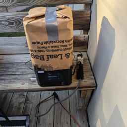

# Printer Camera

## Project Description

This project was conceived because I have a resin 3D printer that I want to run outside. Because the printer is outside, I need to leave it blocked from sunlight. Therefore, I cannot check on the print by lifting the lid (at least not during the daytime).

I have added a temperature sensor to be able to monitor how hot the internals of the printer may be getting. See the developer notes below.

## Developer Notes

The majority of the code as repurposed from the [**motion_camera**](https://github.com/DavidMiles1925/motion_camera) repo. Look there for more detailed documetnation.

### Acceptance Criteria

Upon completion the unit will

- ✔ Turn on a camera on a set interval
- ✔ Turn on a camera with ad hoc command
- ✔ Turn on light(s) before recording with the camera
- ✔ Store videos on SSD to be accessed via SSH
- ✔ Record temperature in a log to be accessed via SSH

### Wiring

DIAGRAM NEEDED

### Pin assignments:

| Pin Name          | Pin Number (BCM) | Purpose                                                |
| :---------------- | :--------------- | :----------------------------------------------------- |
| LIGHT_1_PIN       | 6                | Lighting: Brightening the printing chamber             |
| LIGHT_2_PIN       | 13               | Lighting: Brightening the printing chamber             |
| N/A               | GND (any)        | Lighting: Ground                                       |
| 1-Wire Connection | 4                | Temperature Sensor: THIS WILL REQUIRE ADDITIONAL STEPS |
| N/A               | GND (any)        | Temperature Sensor: Ground                             |
| N/A               | 5V               | Temperature Sensor: Power                              |

**PiCamera must be properly connected or program will not run.**

### Camera

- You will need to ensure picamera2 is installed on your machine.

- I have documented the setup of the camera extensively in the [**Motion Camera Repo**](https://github.com/DavidMiles1925/motion_camera). Refer to this documentation to avoid duplication of efforts.

### Temperature Sensor: DS18B20

`temp.py` to be tested independently before adding functionallity to `main.py`.

Datasheet is included in the repository.

#### One-Wire Interface

One-Wire Interface needs to be enabled to read the data pin. Do this in the RPi config.

**[Documentation](https://pinout.xyz/pinout/1_wire)** can be found here.

**[Tutorial](https://www.circuitbasics.com/raspberry-pi-ds18b20-temperature-sensor-tutorial/)** can be found here.

1. Add to /boot/config.txt

Run the raspberry pi config tool

```bash
sudo raspi-config
```

Select `Interface Options`

Select `1-Wire` and Select "Yes"

2. Reboot

```bash
sudo reboot
```

3. We need to add a bootable kernal to Linux:

```bash
sudo modprobe w1-gpio
sudo modprobe w1-therm
```

4. Change directories and check for attached device:

```bash
cd /sys/bus/w1/devices
ls
```

5. Enter device directory:

```bash
cd 28-XXXXXXXXXXXX
```

6. Check raw temperature readout:

```bash
cat w1_slave
```

#### Code for Temp Sensor

**About**

The library `temp.py` was created using code from the tutorial referenced above.

It was adjusted so that it can be used as a library as well as run as a main function.

The above steps will need to be completed before the code can be run.

**Integration**

I set up the log function to take `prefix=` argument in order to accomodate the temp log.

### Dependencies:

picamera2
ffmpeg

## Gallery


## Printer Notes

### Creality LD-002H



#### Storage Notes

> 10/8/24 - I have put the machine away for possible winter storage. I am getting ready to spend time with the family for a few weeks, and will get it out again afterward if the weather allows.
> Printer was disassembled and parts cleaned. The parts are in the "Resin Printer" drawer.
> FEP was inspected and I determined it was acceptable to store.
> Current known resin profiles were added to this repo.

#### Maintenance Notes

**October 2024**

- Greased the motor screw
- Added magnetic build platform (after destroying the surface of the platform)
- I have noticed what I believe to be paint comming off from somewhere and making its way into the vat. Cleaning may help with this, we'll see next time it is used.

#### Need to Order...

- IPA
- Funnel filters
- Wash Containers

#### Quick Copy/Paste Commands

**Pull Videos and Logs from Pi**

```bash
scp -r PI_NAME@192.168.1.000:/home/PI_NAME/printer_camera/recordings/ /c/users/USER_NAME/downloads
scp -r PI_NAME@192.168.1.000:/home/PI_NAME/printer_camera/logs/ /c/users/USER_NAME/downloads
```

#### Other Documentaion Links

**My article on printing outdoors**  
[Article - Outdoor Resin Printinig](https://www.crealitycloud.com/post-detail/670402b9c42fe1d59f494f52)

**My YouTube video showing outdoor printing**  
[Video - Outdoor Resin Printing](https://youtu.be/wVPIBC5VqVw)

**Resin Settings from Maker Trainer**  
[LD-002H Resin Settings Spreadsheet](https://makertrainer.com/wiki/Creality_LD-002H_resin_settings)

**Calibration Model and Tutorial from Ameralabs**  
[Calibration Tutorial](https://ameralabs.com/blog/town-calibration-part/)
